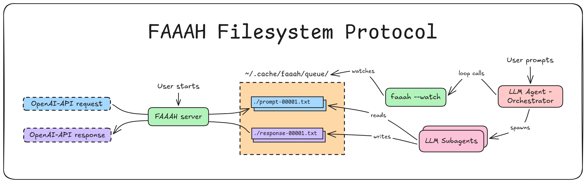

# 🗣️ FAAAH (Filesystem As An AI Handler)

<p align="center">
  
</p>

*The simplest OpenAI-compatible LLM proxy you will ever need.™️*

FAAAH allows you to reuse your AI Agent subscription as a generic
OpenAI-compatible local server.

FAAAH is dependency-free, implemented as a plain-text file protocol
_(UNIX-philosophy certified)_:

1. Instead of sending your prompts to cloud LLM APIs, send them to FAAAH,
   which reads OpenAI-compatible requests and dumps them into a folder as
   `.txt` files.
2. Then, tell your existing AI coding agent (Claude Code, opencode, etc) to
   read the files and write responses to other `.txt` files.
3. FAAAH then packages the responses into OpenAI-compatible JSON, and returns
   them to your app.



## Why?

Because you already pay for an AI coding assistant. Stop paying for API keys
just for your weekend side projects! _faaah!_

It's also an agnostic proxy between any OpenAPI-expecting tool, and any LLM.

As an example, check [**GraphRAG fully driven through
FAAAH**](https://github.com/sebastiancarlos/graphrag-faaah).

## Video Demo

https://github.com/user-attachments/assets/079620cb-e40d-49d0-9d70-7a8f6a6e1f07

## Is This Allowed?

It is my understanding that local, non-commercial use of this tool doesn't
break the existing ToS of any AI agent provider.

But if any lawyer disagrees, kindly send me a message. I would then introduce
you to a friend of mine: Miss Barbra Streisand.

**Be cautious** about using FAAAH to process massive datasets. Some providers
(you know [which ones](https://news.ycombinator.com/item?id=47963204)) might
do some Kafkaesque interpretations of their ambiguous ToS, and deploy
_Orwellian telemetry_ to detect infractions (hasn't happened to me yet, YOLO!)

## Features

- **Zero Dependencies:** Uses Python's `http.server`. That's it.
- **308 lines of code:** Have you seen the *bloat* of other tools in this
  space? Yuck.
- **Unix Philosophy:** Everything is a file. Do one thing well. Keep it KISS,
  ya YAGNI.
- **Universal Compatibility:** If a tool supports the _de-facto_ OpenAI API
  format (GraphRAG, LangChain, LlamaIndex, LiteLLM, the `openai` SDK), it
  supports FAAAH.
- **Agent Agnostic:** Due to the agent entrypoint being *a prompt*, it's not
  tied to any specific agent provider/version. Future-proof.
- **Human-in-the-loop Fallback:** If the AI agent gets stuck or hits usage
  limits, you can literally open the current response file (say
  `response-0004.txt`), type the answer yourself (or copy-paste the request to
  your favorite web chatbot), and hit save. FAAAH will succeed.

## Usage

### 0. Install

Install with `uv`, from inside this repo:

```sh
uv tool install .              # installs the `faaah` command on PATH
uv tool install .[embeddings]  # with the local embeddings extra (see later)
```

Or straight from the git repository:

```sh
uv tool install git+https://github.com/sebastiancarlos/faaah
```

### 1. Start the server

```sh
faaah                       # listens on 127.0.0.1:8000, queue ~/.cache/faaah/queue
faaah --port 8080           # override port
faaah --queue /tmp/q        # override queue directory
faaah --log-dir /tmp/logs   # override session log root (see below)
```

Each run creates a session-log dir (`~/.cache/faaah/sessions/<TIMESTAMP>-<RANDOM>` by
default) that mirrors **every** queue file written or answered during that run,
so you can debug a session even after the queue is wiped on restart:

- `prompt-<id>.txt`, `response-<id>.txt` — same files as the queue
- `request-<id>.json`, `response-<id>.json` — the raw OpenAI request/response
- `embed-<id>-request.json`, `embed-<id>-response.json` — embeddings traffic
- `session.log` — plain-text copy of all log lines

Pass `--log-dir ""` to disable session logging.

### 2. Point your agent at the queue

The agent prompt is printed on startup. To grab it again:

```sh
faaah --agent-message
```

Paste it into your coding agent, which then starts a **FAAAH coordinator
loop**:
- Call `faaah --watch` to obtain the next request (blocks until one exists).
- Delegate the request to a worker subagent (to prevent accumulating
  context).
- Repeat. If a worker leaves no response file, `faaah --watch` simply returns
  the same path again, so the coordinator retries it.

**Note:** FAAAH uses subagents to prevent exhaustion of context on multiple
requests. Thereby, your AI Agents _must support creation of subagents on
request by prompt_.

### 3. Send a request

You can use `curl`, for example:

```bash
curl http://127.0.0.1:8000/v1/chat/completions \
  -H "Content-Type: application/json" \
  -H "Authorization: Bearer anything" \
  -d '{
    "model": "faaah",
    "messages": [{"role": "user", "content": "Write a haiku."}]
  }'
```

Or any OpenAI-API shaped client:

```python
from openai import OpenAI
client = OpenAI(base_url="http://127.0.0.1:8000/v1", api_key="anything")
response = client.chat.completions.create(
    model="faaah", # this field is ignored anyway
    messages=[{"role": "user", "content": "Write a haiku."}],
    timeout=None,           # agents can be slow
).choices[0].message.content
print(response)
```

A dependency-free example lives in `examples/chat.py`. 

For an advanced usage, **GraphRAG fully driven through FAAAH**, see
[graphrag-faaah](https://github.com/sebastiancarlos/graphrag-faaah).

### Embeddings

FAAAH stays dependency-free by default, but can serve local embeddings via the
optional `embeddings` `uv` extra (Installs a spaCy model, `en_core_web_md`):

```bash
uv tool install '.[embeddings]'   # global tool with embeddings (from inside this repo)
uv sync --extra embeddings        # or just the dev environment
```

When installed, `POST /v1/embeddings` returns OpenAI-shaped vectors computed
locally. Without the extra dependencies, the endpoint just returns `503`.

```bash
curl http://127.0.0.1:8000/v1/embeddings \
  -H "Content-Type: application/json" \
  -d '{"model": "en_core_web_md", "input": ["hello world"]}'
```

## CLI usage

```txt
usage: faaah [-h] [--host HOST] [--port PORT] [--queue QUEUE] [--log-dir LOG_DIR] [--timeout TIMEOUT] [--agent-message] [--watch]

Filesystem As An AI Handler: an OpenAI-compatible proxy backed by an AI agent working over text files.

options:
  -h, --help         show this help message and exit
  --host HOST        Address to bind (default: 127.0.0.1).
  --port PORT        Port to listen on (default: 8000).
  --queue QUEUE      Directory where prompt/response files live (default: ~/.cache/faaah/queue).
  --log-dir LOG_DIR  Parent dir for per-session logs (default: ~/.cache/faaah/sessions). A new <TIMESTAMP>-<RANDOM> subdir is created each run; pass empty string to disable.
  --timeout TIMEOUT  Abort each call after N seconds. 0 (default) waits forever.
  --agent-message    Print ONLY the agent prompt and exit (it's also printed on launch).
  --watch            Block until a pending prompt exists, print its path.
```

## Protocol (The "Filesystem API")

The protocol relies on files on the queue directory (`~/.cache/faaah/queue` by
default).

Each request produces a `prompt-<id>.txt` file, where the first one's ID will be
`00001` and increase monotonically.

FAAAH then expects the agent (or anything really) to generate a corresponding
`response-<id>.txt`.

The subagent workers are prompted to write a first pass as
`response-<id>.txt.draft`, which they may revise, before renaming it to the
final `response-<id>.txt` they consider _final_.

| File                      | Who writes | Meaning                             |
| ------------------------- | ---------- | ----------------------------------- |
| `prompt-<id>.txt`         | server     | an incoming request for the agent   |
| `response-<id>.txt.draft` | agent      | an in-progress, editable draft      |
| `response-<id>.txt`       | agent      | the answer                          |

Retry is automatic: a prompt with no response file is simply re-offered by
`faaah --watch` to the coordinator until one appears.

## License

MIT
